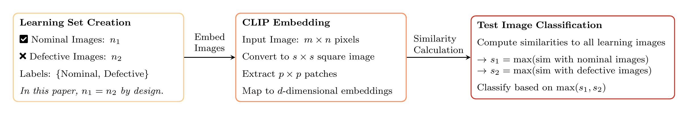

# qe_genai

This repository accompanies the paper **"Adapting OpenAI’s CLIP Model for Few-Shot Image Inspection in Manufacturing Quality Control"**, which explores the extension of the CLIP model (via few-shot learning) for use in manufacturing quality control. We demonstrate the utility of our approach through five case studies. The repository provides all materials necessary to reproduce the experiments and extend the analysis.



---

## Repository Structure

### **`data/`**
Contains images for the five case studies, organized into subfolders according to the labels (`nominal` and `defective`) for each case study:
- **`extrusion_images/`**: Extrusion profile inspection data (Experiment 2)
- **`microstructure/`**: Microstructure image data (Experiment 5)
- **`pan_images/`**: Metallic pan surface inspection data (Experiment 1)
- **`pipe_staple/`**: Renault pipe staple dataset for automotive assembly (Experiment 4)
- **`textile_images/`**: Stochastic textured surfaces (Experiment 3)

### **`results/`**
Contains the output of the analyses, including:
- **Confusion Matrices**: Results for varying few-shot learning sizes and classifiers.
- **GIF Visualizations**: Animated demonstrations of classification performance.
- **CSV Files**: Aggregated metrics from all experiments.

### **`notebook/`**
Provides Python notebooks that implement:
- CLIP-based few-shot classification for all case studies.
- Model evaluation and visualization pipelines.
- Easy-to-use templates for testing new data.

---

## Overview of the Paper

Our work investigates the use of few-shot learning with the CLIP model for image-based quality inspection tasks in manufacturing. Key highlights include:
- **Case Studies**: We evaluate CLIP across five distinct manufacturing datasets, ranging from single-component inspections to complex multi-component scenarios.
- **Few-Shot Learning**: Achieved robust classification accuracy with small learning sets (50–100 images per class).
- **Ease of Use**: Minimal preprocessing and intuitive implementation pipelines make CLIP a practical baseline for practitioners.

---

## Getting Started

### Prerequisites
- Python 3.11+
- Ensure the dependencies listed in the provided notebook are installed in your environment. For example, common libraries include `numpy`, `pandas`, `torch`, and `transformers`.

### Running the Experiments

1. **Using Google Colab**
   Save our Colab notebook to your drive and run it directly:
   [Colab Notebook](https://colab.research.google.com/drive/1l6g3_hWyAhsW2S_KXgLiaasM9YlKcA-G?usp=sharing)

2. **Running Locally**
   - **Download the Repository**
     Clone the repository to your local machine:
     ```bash
     git clone https://github.com/fmegahed/qe_genai.git
     cd qe_genai
     ```
   - **Data Handling**
     You do not need to download the data files manually. The notebook is configured to read the data directly from this GitHub repository.
   - **Clear Existing CSV Files**
     Before running the experiments locally, ensure all CSV files in your directory are cleared. The code appends to these files instead of overwriting them, which may lead to errors if old data remains.

3. **Execute the Notebooks**
   Use the Jupyter notebooks in `notebook/` for replicating experiments or testing new datasets:
   - `image_inspection_with_clip.ipynb`

4. **Visualize Results**
   Outputs such as confusion matrices, animated GIFs, and classification metrics can be found in the `results/` folder.

---

## Results Summary

### Case Studies
1. **Metallic Pan Surface Inspection**: CLIP outperformed traditional approaches with 94% accuracy using 10 examples per class.
2. **Extrusion Profile Analysis**: Demonstrated adaptability to low-resolution data (85x85 pixels) with performance improving up to 80% accuracy using 350 examples.
3. **Stochastic Textured Surfaces**: Achieved 97% accuracy with 50 examples per class.
4. **Pipe Staple Inspection**: Performance was limited for complex, multi-component images, suggesting the need for more advanced techniques.
5. **Microstructure Classification**: Excelled at detecting subtle variations in crystal orientation patterns with high sensitivity (98.7%).

---

## Citation
If you use this repository, please cite our paper:

```
@article{CLIP_quality_control,
  title={Adapting OpenAI’s CLIP Model for Few-Shot Image Inspection in Manufacturing Quality Control},
  author={Hidden for double-blind review},
  journal={Under Review at the Journal of Quality Technology},
  year={2025}
}
```

---

## License
This repository is distributed under the MIT License. See `LICENSE` for details.

---
